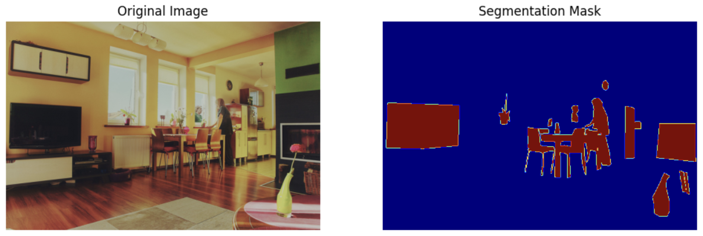
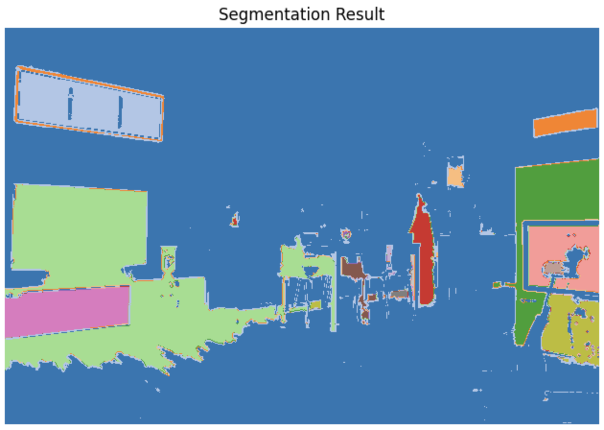
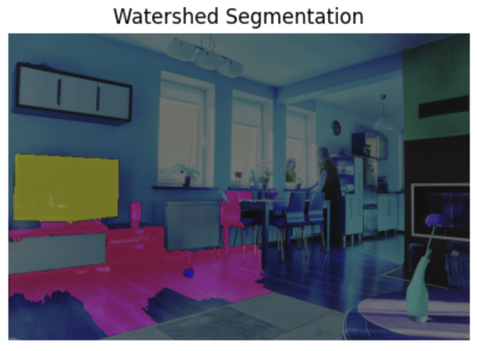
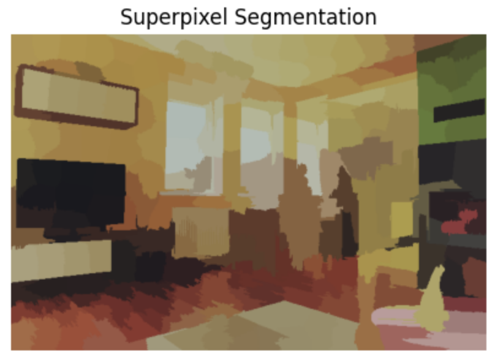
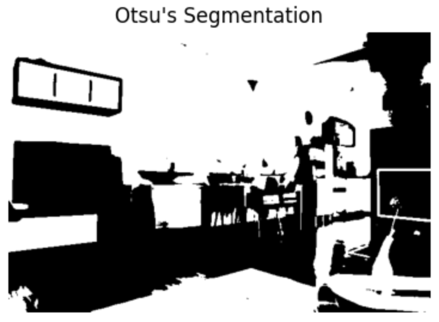

# Adaptive-Image-Segmentation

This project implements a **custom image segmentation algorithm** and compares it against classical segmentation techniques with detailed **visualizations** and **IoU (Intersection over Union)** evaluation.

---

## Overview

The segmentation pipeline is applied to a sample image from the **COCO dataset**. The custom algorithm is designed to capture image boundaries more accurately by combining:
- Seed placement at high-gradient locations
- Adaptive region growing using color and texture similarity
- Boundary refinement based on local color adjustments

We then compare the results against traditional segmentation algorithms: **Watershed**, **SLIC (Superpixels)**, and **Otsu's Method**.

---

## Load Sample Images

We load both:
- The **original COCO image**
- Its **segmentation mask**

<p float="left">
  
</p>

---

## 2. Custom Segmentation Pipeline (Our Approach)

The custom pipeline proceeds in **three stages**:

### 2.1 Seed Initialization

We start by initializing seeds at **high-gradient locations** within each grid cell. This ensures seeds are placed where object boundaries and textures are more likely to be present.

---

### 2.2 Adaptive Region Growing

Each seed region grows based on **color and texture similarity** with its neighboring pixels. A maximum distance threshold limits overexpansion, keeping regions local and distinct.

---

### 2.3 Boundary Refinement

Once regions are formed, their **boundaries are refined**:
- Pixels near edges are re-evaluated.
- Color distances to surrounding regions are computed.
- Pixels are reassigned to their most similar region.

This results in more visually coherent boundaries that align better with real object edges.

<p float="left">
  
</p>

---

## 3. IoU Evaluation

For each segmentation output, we compute the **Intersection over Union (IoU)** between predicted and ground truth masks:

```python
def compute_iou(mask_gt, mask_pred):
    intersection = np.logical_and(mask_gt, mask_pred).sum()
    union = np.logical_or(mask_gt, mask_pred).sum()
    return intersection / union
```

IoU scores are computed for:
- Our method
- Watershed
- SLIC
- Otsu

---

## 4. Comparison with Traditional Methods

We apply 3 classical segmentation algorithms and visualize their results alongside ours.

### Watershed

<p float="left">
  
</p>

---

### SLIC (Superpixels)

<p float="left">
  
</p>

---

### Otsu's Method

<p float="left">
  
</p>

---

##  5. IoU Results Summary

| Method              | Mean IoU Score |
|---------------------|-----------|
| **Our Approach**     | ⭐ 0.162 |
| Watershed           | 0.088  |
| SLIC (Superpixels)  | 0.011    |
| Otsu's Method       | 0.013    |

---

## Conclusion

- Our segmentation algorithm, by incorporating **local gradients, texture and color thresholds**, and **boundary refinement**, achieves **higher segmentation quality** than classical methods.
- It performs especially well in complex images with fine details, improving both **visual accuracy** and **quantitative IoU scores**.

---
